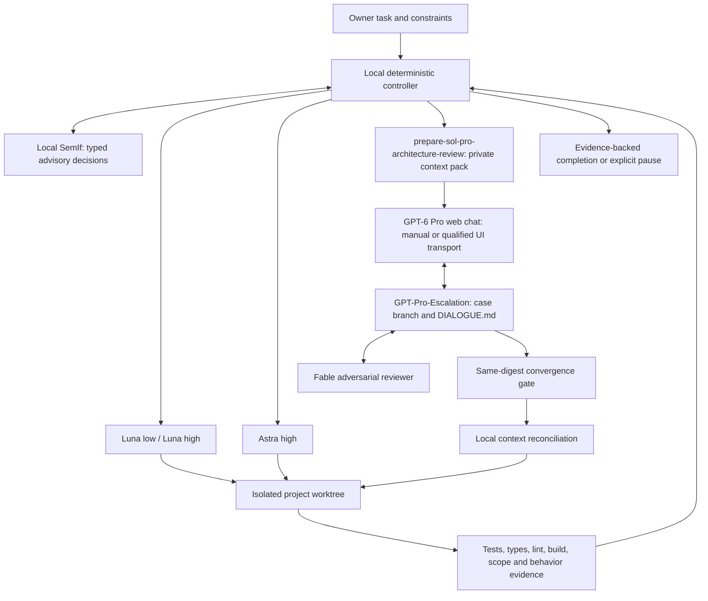

# Architecture

Status: normative target design. Implemented subset: reference kernel, direct skill revisions and installation tooling. Live orchestration remains to be integrated.

## 1. Objective

Complete software tasks reliably with the least necessary model work, without hiding uncertainty or sacrificing review of consequential decisions. Optimize successful, accepted changes rather than model-call counts alone. Keep the owner-facing workflow to one Codex task, with resumable escalation when needed.

## 2. Components and authority



**Local controller.** A small Python process owns task state, policy, limits, subprocess execution, evidence collection, Git transport, and transport receipts. Begin with a single process and a local SQLite database, not a service mesh. The Python version must be compatible with the chosen local integration environment; the reference code requires 3.11+.

**Codex coding workers.** The controller invokes the selected model and reasoning level through a supported, locally verified Codex interface. Each dispatch carries an explicit task, working directory, allowed paths, immutable requirements, current snapshot, and relevant evidence. It records the observed model, not just the requested one. A sentence asking a running model to become another model is not dispatch.

**SemIf.** A local scoring backend answers bounded questions at decision boundaries. It cannot write code, approve exports, alter policy, run tools, waive checks, or decide architecture. Its selected option can raise a routing floor or request more review; it cannot lower mandatory requirements.

**Verification runner.** Executes a locked, project-specific check plan. It captures exit status, command, working directory, environment/tool versions, duration, relevant logs, and snapshot identity. It is not an LLM judging whether a compiler probably succeeded. Tests are evidence about covered behavior, not universal proof.

**Deep-work bridge.** `prepare-sol-pro-architecture-review` prepares the case and coordinates transfer of the approved ZIP and prompt to GPT-6 Pro in the authenticated ChatGPT web interface. `fable-adversarial-review` becomes active only after Pro's initial contribution is durable. The original local Codex coordinator remains the workflow owner. Standard Computer Use currently excludes automating ChatGPT itself; manual transfer is the default, and future UI automation must pass `docs/COMPUTER-USE-GATE.md`.

**Review workspace.** `GPT-Pro-Escalation` stores one isolated case per branch and path. `DIALOGUE.md` is the shared communication document; versioned solution files and structured approvals provide machine-checkable state. A model may write through a verified Git connector, or the coordinator may commit its exact validated output as a labelled relay. A relay does not perform the substantive review on the model's behalf.

## 3. Repository roles

| Repository or storage | Purpose | Default treatment |
| --- | --- | --- |
| `AgenticArch` | Reusable specification, code, templates, public examples | Public; generic content only |
| Actual target project | Software to be changed and its tests | Preserve owner permissions and branch policy |
| `GPT-Pro-Escalation` | Pro/Fable case work and review record | Private for real cases; never auto-change visibility |
| Local state directory outside public Git | Chats, receipts, bundles, logs, checkpoints | Owner-only permissions, explicit retention |

The target project can be AgenticArch during its own implementation. That does not make runtime case data suitable for this public repository. Do not assume the review repository already exists or is authorized merely because its name appears in a prompt.

## 4. Primary flow

1. Capture the owner's goal, exclusions, acceptance criteria, current project state, and permitted side effects. Identify architecture/research and high-consequence design before implementation. If risk classification is incomplete, inspect first; do not permit low-lane edits simply because SemIf selected them.
2. Apply deterministic routing floors; ask SemIf only for remaining bounded uncertainty. Dispatch the smallest permitted lane that fits the actual work. Direct Pro routing bypasses the cheaper ladder.
3. Work in a scoped worktree. Checkpoint the exact task state, including pre-existing modifications without committing secrets. Reclassify when the blast radius or nature of the work changes.
4. Run verification on the post-change snapshot and map acceptance criteria to evidence. Retry only with a concrete correction hypothesis. Escalate on insufficient capability or lack of progress, not on missing credentials or a broken development environment.
5. For Pro work, create a redacted context pack and approved export manifest, bind a single web chat, and produce a versioned solution in the review repository.
6. Run alternating Fable/Pro turns until both independently approve the same solution digest and all blocking objections are resolved. Respect resumable time, quota, and round budgets. A pause does not authorize implementation of an unapproved result.
7. Fetch the exact agreed revision into the original local session. Compare it with the current project and local capabilities. Implement the approved intent closely, recording necessary local adjustments and returning consequential differences for focused review in the same case/chat.
8. Re-run local acceptance checks on the final snapshot. Only the local controller may release a completion report. Remote agreement alone never completes the coding task.

## 5. Minimal runtime shape

```text
agenticarch/
  controller.py       state machine; dispatch; checkpoints
  policy.py           routing floors; retry and completion guards
  store.py            SQLite transactions, event log, outbox, leases
  evidence.py         scoped snapshot and command-result collection
  adapters/
    codex.py          verified local Codex invocation
    semif.py          pinned local scoring interface
    chatgpt_ui.py     existing-chat browser transport
    fable.py          discovered local Fable integration
    git_case.py       branch isolation, writes, readback, digests
  bundle.py           allowlisted redaction and manifests
  cli.py              doctor / run / status / resume / cancel / case
```

This is a proposed implementation layout, not a list of existing runtime modules. Reuse existing local skill utilities rather than duplicating their functionality. Prefer JSON/TOML, Git, and SQLite; avoid new network services unless actual measurements justify them.

## 6. Why a controller instead of instructions alone

Instructions describe desired behavior. A controller can reject an invalid lane, preserve a chat binding across restarts, prevent a repeated upload, tie evidence to a particular tree, and refuse a stale approval. Those checks remain necessary even when every participating model is highly capable. They also make failures inspectable without relying on a chat transcript.

Do not optimize the routing system into a second coding agent. Most straightforward decisions should be made by policy or deterministic tools. The coordinator's semantic planning uses the same routing constraints as the implementation workers.

## 7. Workstation integration and requirements

The primary integration point is the owner's custom Codex with local/remote providers. Keep the deterministic controller small and use local helpers for evidence retrieval and candidate testing, not as an unauthorized replacement for required model lanes. See [owner requirements](OWNER-REQUIREMENTS.md), [workstation design](WORKSTATION-DESIGN.md), [adapter contracts](ADAPTER-CONTRACTS.md) and [the Pro transport gate](COMPUTER-USE-GATE.md).

## 8. Semantic decision plane beyond routing

The selected extension is an event-driven local decision plane, not a second autonomous planner. SemIf can suggest context relevance, requirement gaps, next diagnostics, version-aware memory relations, debate-objection links and semantic drift. Deterministic software constrains actions and keeps evidence/authorization separate. This is a designed extension; the production hooks remain to be implemented.

Read [the researched opportunities](SEMANTIC-DECISION-OPPORTUNITIES.md), [the decision-plane contract](DECISION-PLANE.md) and [its evaluation gates](DECISION-EVALUATION.md). Start with independent atomic questions about exact snapshots and qualified advisory use; preserve all model floors and Pro/Fable approvals.
